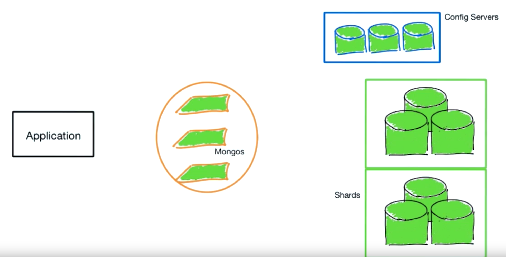
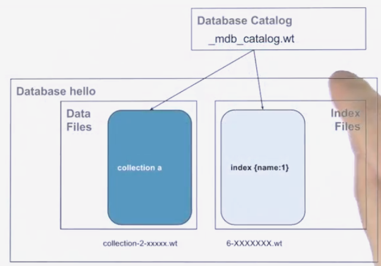
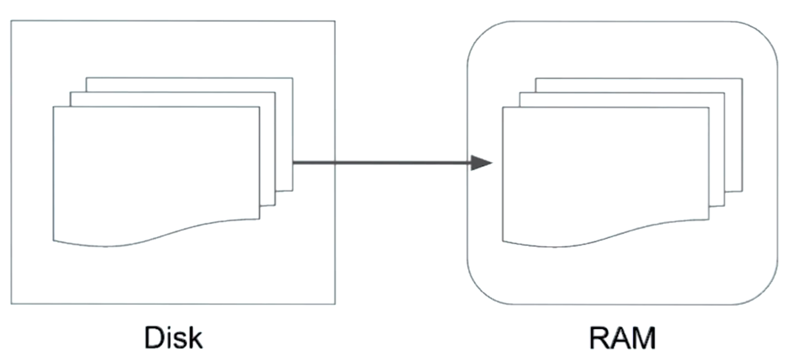
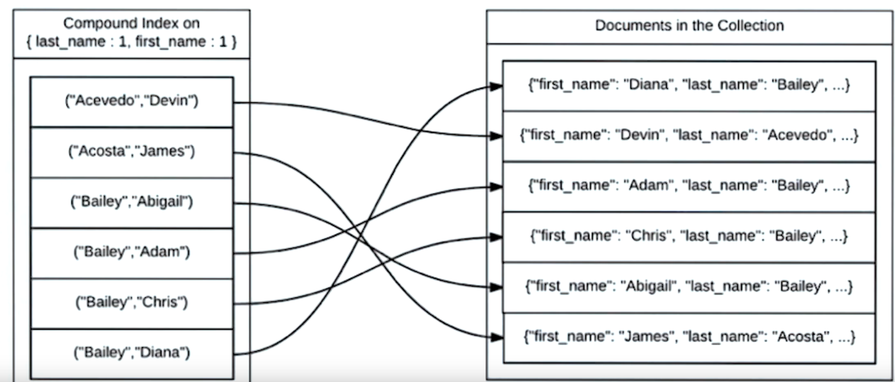
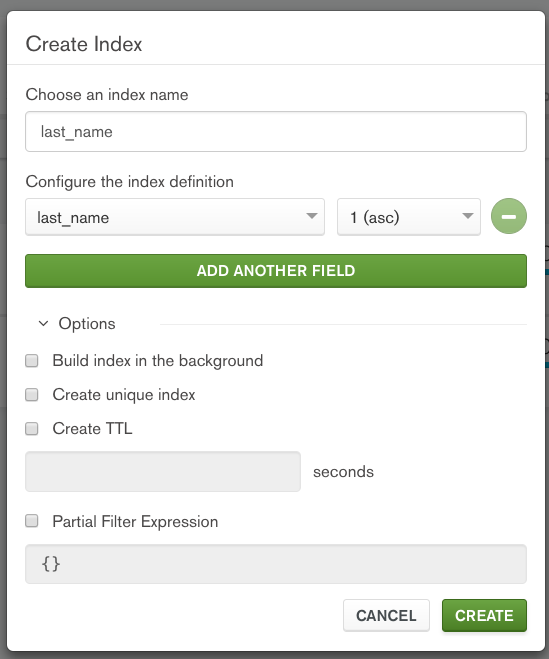
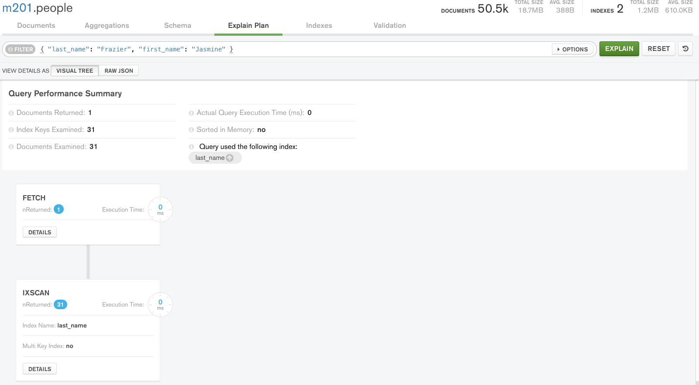
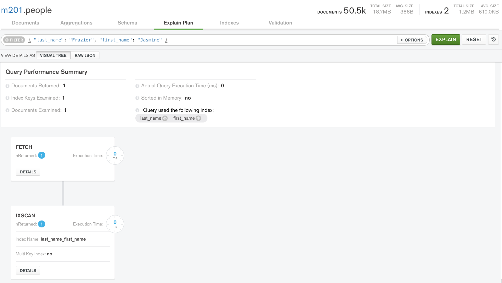
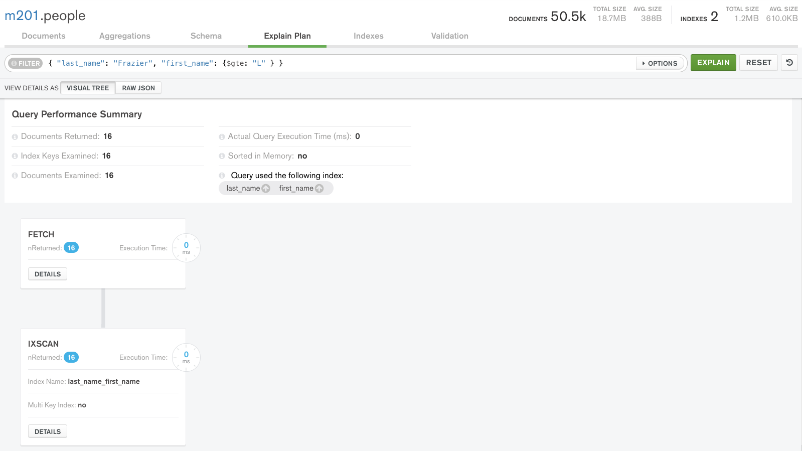
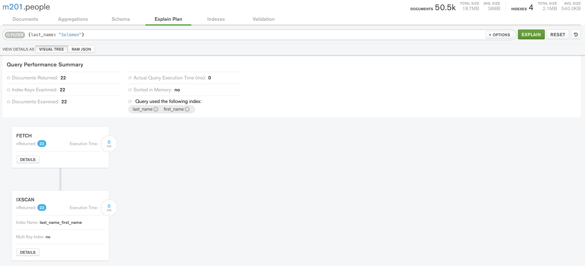
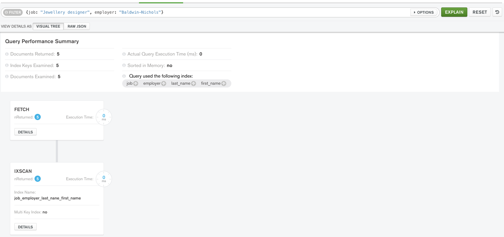

<!-- START doctoc generated TOC please keep comment here to allow auto update -->
<!-- DON'T EDIT THIS SECTION, INSTEAD RE-RUN doctoc TO UPDATE -->
**Table of Contents**  *generated with [DocToc](https://github.com/thlorenz/doctoc)*

- [MongoDB Performance](#mongodb-performance)
  - [Chapter 1: Introduction](#chapter-1-introduction)
    - [Lecture: Hardware Considerations and Configurations Part 1](#lecture-hardware-considerations-and-configurations-part-1)
    - [Lecture: Hardware Considerations and Configurations Part 2](#lecture-hardware-considerations-and-configurations-part-2)
    - [Lab 1.1: Install Course Dependencies](#lab-11-install-course-dependencies)
  - [Chapter 2: MongoDB Indexes](#chapter-2-mongodb-indexes)
    - [Lecture: Introduction to Indexes](#lecture-introduction-to-indexes)
    - [Lecture: How Data is Stored on Disk](#lecture-how-data-is-stored-on-disk)
    - [Lecture: Single Field Indexes Part 1](#lecture-single-field-indexes-part-1)
    - [Lecture: Single Field Indexes Part 2](#lecture-single-field-indexes-part-2)
    - [Lecture: Sorting with Indexes](#lecture-sorting-with-indexes)
      - [Methods for sorting](#methods-for-sorting)
      - [In-Memory Sorting](#in-memory-sorting)
      - [Index Sorting](#index-sorting)
    - [Lecture Querying on Compound Indexes Part 1](#lecture-querying-on-compound-indexes-part-1)
    - [Lecture: Querying on Compound Indexes Part 2](#lecture-querying-on-compound-indexes-part-2)

<!-- END doctoc generated TOC please keep comment here to allow auto update -->

# MongoDB Performance

> My course notes from M201: MongoDB Performance at [MongoDB University](https://university.mongodb.com/)

## Chapter 1: Introduction

### Lecture: Hardware Considerations and Configurations Part 1

Out of scope: Full discussion of how to tune and size hardware for given deployment. But will cover the basics.


Main resources MongoDB relies on to operate:
- CPU for processing and calculations
- Memory for execution -> IMPORTANT!
- Disk and IO for persistency and communications between servers or within host processes

**Memory**

RAM having come down in price makes prevalence of dbs that are designed around usage of memory. It's also 25x faster than SSD's.

Operations depending heavily on memory include:
- Aggregation
- Index Traversing
- Write Operations
- Query Engine (to retrieve query results)
- Connections (~1MB per established connection)

Generally, the more memory MongoDB has available to it, the better its performance will be.

**CPU**

Used by all applications, database is just one of them. Two main factors of MongoDB associated with CPU:
- Storage Engine
- Concurrency Model

By default, MongoDB will try to use all available cores to respond to incoming requests.

Non locking Storage Engine - WiredTiger - relies heavily on CPU to process requests.

If have non-blocking operations (eg: concurrent writes of documents, or responding to query requests - reads), MongoDB performs better the more CPU resources are available.

Operations requiring availability of CPU cycles:
- Page Compression
- Data Calculation
- Aggrgation Framework Operations
- Map Reduce

### Lecture: Hardware Considerations and Configurations Part 2

Not all reads and writes are non blocking operations, such as writing constantly to same document (in-place update) requires each write to block all other writes on that document. eg: given a document

```javascript
{
  _id: "FC Porto",
  message: "Best Club in the World!",
  championships: 756
}
```

And the following series of numerous updates:

```javascript
db.clubs.update({_id: 'FC Porto'}, {$inc: {championship : 1}})
db.clubs.update({_id: 'FC Porto'}, {$inc: {championship : 1}})
...
db.clubs.update({_id: 'FC Porto'}, {$inc: {championship : 1}})
```

In above case, multiple cpu's won't help performance because this work cannot be done in parallel, because they all affect the same document.

**IOPS**

MongoDB uses disk to persist data. IOPS: Input/Output operations per second provided by server. The faster this is, the faster mongo can read/write data. Type of disk will greatly affect MongoDB performance.


Disks can be used in different architectures such as RAID for redundancy of read and write operations.


MongoDB benefits from some but not all architectures.

Recommended raid architecture for MongoDB is RAID LEVEL 10. Offers more redundancy and safeguard guarantees with good performance combination.

DO NOT USE RAID 5, RAID 6. Also avoid RAID 0 - has good write performance but limited availability, can lead to reduced performance on read operations.

RAID 10 provides benefits needed by MongoDB:
- Redundancy of segments across physical drives
- Allows extended performance due to parallelization of multiple writes, reads and reads and writes in same disk allocated segments.

Important aspect of MongoDB is the need to write to several different disks. This distributes IO load of different databases, indexes, journaling and lock files -> optimizes performance.

**Network**

MongoDB is a distributed database for high availability, therefore deployment also depends on network hardware. Faster and larger is bandwidth for network -> better performance.



- Applications reach database by establishing connections to host where MongoDB instance is running.
- High availability achieved with replica cluster sets.
- Horizontal scaling achieved with sharding cluster.

The way that different hosts that are holding different nodes of cluster are connected will affect performance. Other considerations include:
- Types of network switches
- Load balancer
- Firewalls
- How far apart cluster nodes are (across different data centers or regions)
- Types of connections between data centers (i.e. latency - can't go faster than speed of light)

Application, while emitting commands can set:
- Write Concern
- Read Concern
- Read Preference

These need to be taken into consideration when analyzing performance of application.

### Lab 1.1: Install Course Dependencies

Attempt course with Docker:

```shell
docker pull mongo:4.0.0
docker run \
  -p 27018:27017 \
  --name course-mongo \
  -v $(pwd)/input:/data/configdb \
  -v course-mongo-data:/data/db \
  -d mongo:4.0.0
docker exec -it course-mongo bash
mongoimport --db m201 --collection people --file /data/configdb/people.json
mongo
show dbs
use m201
db.people.count({ "email" : {"$exists": 1} })
# submit answer
```

Also install [Compass](https://www.mongodb.com/download-center#compass)

## Chapter 2: MongoDB Indexes

### Lecture: Introduction to Indexes

Indexes trying to solve problem of slow queries.

Example from physical world - book on interior design, trying to find section on bedspreads, could look page by page but that's slow. Faster go to back of book where index is - sorted alphabetically by keywrods with page number. Can quickly find which page the bedspreads section is on.

Translating abvoe example to MongoDB, "Book" -> "Collection".

*Collection Scan:* If not using an index when querying collection, db will have to examine every document. As collection grows in size, will have to search through more documents. This is `O(N)` - linear running time - run time of query is linearly proportional to number of documents `N` in collection.

Index will improve performance:


Index limits search space - don't need to search every document, instead, search through ordered index.

Index keeps reference to every document in collection. Index is list of key-value pairs:
- key: value of field that has been indexed on
- value: value of key is reference to document containing the key

Index is associated with one or more fields (last_name in above example).

When creating an index, must specify which fields from documents want to index on.

`_id` field is automatically indexed.

If a query isn't searching by `_id`, then the `_id` index won't be used.

Can have many indexes on same collection.

Index keys are stored in order. This means db doesn't need to look at every index entry to find the one being queried on.

Index stored in B-tree, used to find target values with few comparisons:


When new documents are inserted, each new insertion doesn't necessarily imply another comparison.

In above example, if searching for value `15`, search wouldn't change if `5` gets inserted.


**Index Overhead**

Performance gain of using index has a cost - each additional index decreases write speed on collection. Every time new document insrted in collection, all the collection's indexes need to be updated.

Also if document is updated or removed, some of the indexes (aka b-trees) may need to be rebalanced.

Be careful when creating indexes - don't create unnecessarily because will affect insert/update/delete performance on that collection.

### Lecture: How Data is Stored on Disk

Databases persist data using the server's file system.


The way mongo stores data on disk differs depending on storage engine supported by MongoDB. Particular details of how each storage engine works are out of scope of this course. But high level review of how each organizes data.

MongoDB supports creating several different data management objects:

```javascript
db.collection.insert({_id: 1})
```


**Database**


- Databases are logical groups of collections.
- Collections are operational units that group documents together.
- Indexes on collections over fields present in documents.
- Documents - atomic units of information used by applications.

**dbpath dir**

Looking at contents of `dbpath` directory, for example, can specify path at mongod startup (this one is default):

```shell
mongod --dbpath /ata/db --fork --logpath /data/db/mongodb.log # start
mongo admin --eval 'db.shutdownServer()'                      # stop
```

Or using Docker:

```shell
docker start course-mongo
docker exec -it course-mongo bash
cd /data/db
ls -l
```

Files:

```
WiredTiger                           diagnostic.data
WiredTiger.lock                      index-1-5808622382818253038.wt
WiredTiger.turtle                    index-3-5808622382818253038.wt
WiredTiger.wt                        index-5-5808622382818253038.wt
WiredTigerLAS.wt                     index-6-5808622382818253038.wt
_mdb_catalog.wt                      index-8-5808622382818253038.wt
collection-0-5808622382818253038.wt  journal
collection-2-5808622382818253038.wt  mongod.lock
collection-4-5808622382818253038.wt  sizeStorer.wt
collection-7-5808622382818253038.wt  storage.bson
```

For each collection and index, WiredTiger storage engine writes an individual `.wt` file.

Catalog file contains catalog of all collections and indexes that mongod contains.



Above is simple flat file organization. Can also have more elaborate structure. Startup mongo with `directoryperdb` instruction:

```shell
docker run \
  -p 27019:27017 \
  --name experiment-mongo \
  -d mongo:4.0.0 --directoryperdb
docker exec -it experiment-mongo bash
mongo hello --eval 'db.a.insert({a:1}, {writeConcern: {w: 1, j:true}})' # write a doc to new db `hello`, collection `a`
ls /data/db
```

This time directory listing is organized differently:

```
WiredTiger       WiredTiger.turtle  WiredTigerLAS.wt  admin   diagnostic.data  journal  mongod.lock    storage.bson
WiredTiger.lock  WiredTiger.wt      _mdb_catalog.wt   config  hello            local    sizeStorer.wt
```

Note 3 new folders due to having specified `directoryperdb` at startup, creates one folder per database:
- admin: default database created by MongoDB
- local: default database created by MongoDB
- hello: newly created database from our insert instruction

Looking inside folder of newly created db:

```shell
ls /data/db/hello
collection-7-1343607420274581578.wt  index-8-1343607420274581578.wt
```

Contains one collection file and one index file (always get _id index).

With WiredTiger storage engine, can go a little further with disk organization. Remove previous container and start again but with `wiredTigerDirectoryForIndexes` instruction:

```shell
docker stop experiment-mongo
docker rm -f experiment-mongo
docker run \
  -p 27019:27017 \
  --name experiment-mongo \
  -d mongo:4.0.0 --directoryperdb --wiredTigerDirectoryForIndexes
docker exec -it experiment-mongo bash
mongo hello --eval 'db.a.insert({a:1}, {writeConcern: {w: 1, j:true}})'
ls /data/db # still get one directory per db
ls /data/db/hello # collection index
```

This time have a directory `collection` and directory `index`:

```shell
ls /data/db/hello/collection/
7--6924425517033069288.wt
ls /data/db/hello/index/
8--6924425517033069288.wt
```

**What does this have to do with performance?**


If have several different disks on server, organizing data as above allows great degree of IO parallelization.

Mongo creates symbolic links to mount points on differnet physical drives.

Every read and write to mongo will use two data structures - collections and indexes. Parallelization of IO improves overall throughput of persistency layer.

**Compression**

Mongo also offers compression for storing data on disk - instruct storage engine to store data on disk using compression algorithm.


Compression improves performance by making each IO operation smaller, which will be faster, but cost more CPU cycles.

Before writing data to disk, data is allocated in memory:


All data in memory is eventually written to disk. This process triggerred by:
- User/application specifies a particular write concern or forcing a sync operation, eg: `db.collection.insert({...}, {writeConcern: {w:3}})`
- Checkpoint: periodic internal process that regulates how data should be flushed/synced into the data file (defined by sync periods).

**Journaling**

Essential component of persistence. Journal file acts as safeguard against data corruption caused by incopmlete file writes. eg: if system sufferes unexpected shutdown, data stored in journal is used to recover to a consistent and correct state.

```shell
ls /data/db/journal
WiredTigerLog.0000000001      WiredTigerPreplog.0000000002
WiredTigerPreplog.0000000001
```

Journal file structure includes individual write operations. To minimize performance impact of journalling, flushes performed with group commits in compressed format. Writes to journal are atomic to ensure consistency of journal files.

App con force data to be synced to journal before acknowledging a write:

```javascript
db.collection.insert({...}, {writeConcern: {w: 1, j: true}})
```

Setting `j: true` will impact performance because mongo will wait until sync is done to disk before confirming the write has been acknowledged.

### Lecture: Single Field Indexes Part 1

Simplest index, foundation for later more complex indexes. Index that captures keys on a single field.

```javascript
db.<collection>.createIndex({ <field>: <direction> })
```

**Features**

- Keys from only one field
- Can find a single value for the indexed field
- Can find a range of values
- Can use dot notation to index fields in subdocuments
- Can be used to find several distinct values in a single query

Use container where `people.json` was loaded earlier and open mongo shell:

```shell
docker exec -it course-mongo bash
mongo
```

Find a particular person by ssn, appending `explain` function to get more information about query execution:

```javascript
use m201
db.people.find({"ssn": "720-38-5636"}).explain("executionStats")
```

Output:

```
{
	"queryPlanner" : {
		"plannerVersion" : 1,
		"namespace" : "m201.people",
		"indexFilterSet" : false,
		"parsedQuery" : {
			"ssn" : {
				"$eq" : "720-38-5636"
			}
		},
		"winningPlan" : {
			"stage" : "COLLSCAN",
			"filter" : {
				"ssn" : {
					"$eq" : "720-38-5636"
				}
			},
			"direction" : "forward"
		},
		"rejectedPlans" : [ ]
	},
	"executionStats" : {
		"executionSuccess" : true,
		"nReturned" : 1,
		"executionTimeMillis" : 59,
		"totalKeysExamined" : 0,
		"totalDocsExamined" : 50474,
		"executionStages" : {
			"stage" : "COLLSCAN",
			"filter" : {
				"ssn" : {
					"$eq" : "720-38-5636"
				}
			},
			"nReturned" : 1,
			"executionTimeMillisEstimate" : 40,
			"works" : 50476,
			"advanced" : 1,
			"needTime" : 50474,
			"needYield" : 0,
			"saveState" : 394,
			"restoreState" : 394,
			"isEOF" : 1,
			"invalidates" : 0,
			"direction" : "forward",
			"docsExamined" : 50474
		}
	},
	"serverInfo" : {
		"host" : "4efd23485cb9",
		"port" : 27017,
		"version" : "4.0.0",
		"gitVersion" : "3b07af3d4f471ae89e8186d33bbb1d5259597d51"
	},
	"ok" : 1
}
```

Later in course, will go over output in more detail. For now, just care about a few fields:

- `queryPlanner` indicates collection scanning will be used `COLLSCAN` - looking at EVERY document in collection.
- `executionStats` indicates had to examine `50474` documents, which is number of documents in collection.
- `executionStats` also indicates only `1` document returned.
- `totalKeysExamined: 0` - looked at 0 index keys, i.e. no index used because we haven't created any yet.

Bad ratio, inefficient query: 1 doc returned / 50474 examined.

Create an index from mongo shell, on people collection, ssn field, 1 for ascending:

```javascript
db.people.createIndex({ssn: 1})
```

Running above command makes MongoDB build the index. To do so, it must look at every doc in collection, pulling out `ssn` field. If ssn field not present on a doc, key entry will have null value.

Run query again with explain:

```javascript
exp = db.people.explain("executionStats")  // create explainable object
exp.find({"ssn": "720-38-5636"}) // run find on explain object
```

Output:

```
{
	"queryPlanner" : {
		"plannerVersion" : 1,
		"namespace" : "m201.people",
		"indexFilterSet" : false,
		"parsedQuery" : {
			"ssn" : {
				"$eq" : "720-38-5636"
			}
		},
		"winningPlan" : {
			"stage" : "FETCH",
			"inputStage" : {
				"stage" : "IXSCAN",
				"keyPattern" : {
					"ssn" : 1
				},
				"indexName" : "ssn_1",
				"isMultiKey" : false,
				"multiKeyPaths" : {
					"ssn" : [ ]
				},
				"isUnique" : false,
				"isSparse" : false,
				"isPartial" : false,
				"indexVersion" : 2,
				"direction" : "forward",
				"indexBounds" : {
					"ssn" : [
						"[\"720-38-5636\", \"720-38-5636\"]"
					]
				}
			}
		},
		"rejectedPlans" : [ ]
	},
	"executionStats" : {
		"executionSuccess" : true,
		"nReturned" : 1,
		"executionTimeMillis" : 0,
		"totalKeysExamined" : 1,
		"totalDocsExamined" : 1,
		"executionStages" : {
			"stage" : "FETCH",
			"nReturned" : 1,
			"executionTimeMillisEstimate" : 0,
			"works" : 2,
			"advanced" : 1,
			"needTime" : 0,
			"needYield" : 0,
			"saveState" : 0,
			"restoreState" : 0,
			"isEOF" : 1,
			"invalidates" : 0,
			"docsExamined" : 1,
			"alreadyHasObj" : 0,
			"inputStage" : {
				"stage" : "IXSCAN",
				"nReturned" : 1,
				"executionTimeMillisEstimate" : 0,
				"works" : 2,
				"advanced" : 1,
				"needTime" : 0,
				"needYield" : 0,
				"saveState" : 0,
				"restoreState" : 0,
				"isEOF" : 1,
				"invalidates" : 0,
				"keyPattern" : {
					"ssn" : 1
				},
				"indexName" : "ssn_1",
				"isMultiKey" : false,
				"multiKeyPaths" : {
					"ssn" : [ ]
				},
				"isUnique" : false,
				"isSparse" : false,
				"isPartial" : false,
				"indexVersion" : 2,
				"direction" : "forward",
				"indexBounds" : {
					"ssn" : [
						"[\"720-38-5636\", \"720-38-5636\"]"
					]
				},
				"keysExamined" : 1,
				"seeks" : 1,
				"dupsTested" : 0,
				"dupsDropped" : 0,
				"seenInvalidated" : 0
			}
		}
	},
	"serverInfo" : {
		"host" : "4efd23485cb9",
		"port" : 27017,
		"version" : "4.0.0",
		"gitVersion" : "3b07af3d4f471ae89e8186d33bbb1d5259597d51"
	},
	"ok" : 1
}
```

This time, query is more efficient:
- `winningPlan` is index scan `IXSCAN`.
- `executionStatus` has one doc returned as before: `nReturned: 1`
- but only had to look at one doc: `totalDocsExamined: 1`
- index keys were used: `totalKeysExamined: 1`

If query predicate doesn't use a field that is indexed, then will still have collection scan:

```javascript
exp.find({last_name: "Acevedo"})
```

In this case had to examine all 50K docs to return the 10 that match query predicate.

**Dot Notation**

MongoDB allows dot notation to query inside subdocument. Can also use dot notation when specifying indexes.

Example, insert a docs with subdocs into examples collection:

```javascript
db.examples.insertOne({_id: 0, subdoc: {indexedField: "value", otherField: "value"}})
db.examples.insertOne({_id: 1, subdoc: {indexedField: "wrongValue", otherField: "value"}})
```

Specify index on subdoc using dot notation, then use it in a query and verify index is being used.

```javascript
db.examples.createIndex({"subdoc.indexedField": 1})
db.examples.explain("executionStats").find({"subdoc.indexedField": "value"})
```

NEVER index on field that points to a subdocument, `subdoc` field in above example, would have to query on entire subdocument to make use of index.

### Lecture: Single Field Indexes Part 2

**Range**

```javascript
exp.find({ssn: {$gte: "555-00-0000", $lt: "556-00-0000"}})
```

Since ssn is indexed, index will be used for this query. Only had to examine 49 docs to return 49 docs:

```javascript
"executionStats" : {
  "executionSuccess" : true,
  "nReturned" : 49,
  "executionTimeMillis" : 0,
  "totalKeysExamined" : 49,
  "totalDocsExamined" : 49,
  ...
```

**Set**

```javascript
exp.find({"ssn": {$in: ["001-29-9184", "177-45-0950", "265-67-9973"]}})
```

Index is still used. Only had to examine 3 docs to find the 3 docs matching this query:

```javascript
"executionStats" : {
  "executionSuccess" : true,
  "nReturned" : 3,
  "executionTimeMillis" : 0,
  "totalKeysExamined" : 6,
  "totalDocsExamined" : 3,
```

Note 6 index keys examined, might have expected 3. Due to search algorithm overshooting values being searched for.

Can also specify multiple fields in query, index will still be used even if not all fields are indexed:

```javascript
exp.find({"ssn": {$in: ["001-29-9184", "177-45-0950", "265-67-9973"]}, last_name: {$gte: "H"}})
```

`winningPlan` shows index scan is used to filter down documents matching `ssn`. Then from those results (3 docs), they are further filtered by `last_name` predicate.

```javascript
"winningPlan" : {
  "stage" : "FETCH",
  "filter" : {
    "last_name" : {
      "$gte" : "H"
    }
  },
  "inputStage" : {
    "stage" : "IXSCAN",
    "keyPattern" : {
      "ssn" : 1
    },
```

If query is querying by 2 or more fields where only one of those fields is indexed on (i.e. single key index), db will filter using index, and then look only at filtered docs to `FETCH` the ones that match the other predicates.
Compound indexes can make this even more efficient (later in course).

### Lecture: Sorting with Indexes

Indexes can also be used to sort documents in query. Any query can also be sorted:

```javascript
db.people.find({first_name: "James"}).sort({first_name: 1})
```

#### Methods for sorting

Any query can be sorted:

```javascript
db.people.find({firsr_name: "James"}).sort({first_name: 1})
```

#### In-Memory Sorting



- Documents are stored on disk in unknown order.
- When queried, docs returned in whatever order server finds them, which is rarely what application wants.
- To have docs sorted in particular order, server must read docs from disk into RAM, then perform sorting algorithm on docs in RAM.
- With large number of docs, may be very slow.
- Sorting large mumber of docs in memory is expensive operation -> server will abort in-memory sorting when 32MB of memory have been used.

#### Index Sorting


- Keys are ordered according to field specified at index creation.
- Server can take advantage for sorting, if query is using index scan, order of docs returned is guaranteed to be sorted by the index keys -> i.e. no need to perform explicit sort as docs will be fetched from server in sorted order.
- Note docs will only be ordered by fields that make up the index. eg: if index is on last_name ascending, docs will be ordered according to last_name ascending.
- Query planner will use indexes that can be helpful in fulfilling query predicate OR query sort.

Example, find docs sorted by social security number:

```javascript
db.people.find({}, {_id: 0, last_nane: 1, first_name: 1, ssn: 1}).sort({ssn: 1})
```

Returns first 20 docs from `people` collection, sorted by ssn.

Create explainable object:

```javascript
var exp = db.people.explain('executionStats')
exp.find({}, {_id: 0, last_nane: 1, first_name: 1, ssn: 1}).sort({ssn: 1})
```

Execution stats shows had to look at ~50K docs to return ~50k docs, notice also ~50K index keys examained:

```
"executionStats" : {
	"nReturned" : 50474,
	"totalKeysExamined" : 50474,
	"totalDocsExamined" : 50474,
	...
```

But input stage also shows index is used (recall earlier we ran `db.people.createIndex({ssn: 1})`):

```
"inputStage" : {
	"stage" : "FETCH",
	"inputStage" : {
			"stage" : "IXSCAN",
			"keyPattern" : {
				"ssn" : 1
			},
			"indexName" : "ssn_1",
			...
```

In this case index was not used for filtering docs, but for sorting.

If sort by first_name, for which there is no index, note no index keys examed and collection scan used to read all docs into memory, then did in-memory sort.

```javascript
exp.find({}, {_id: 0, last_nane: 1, first_name: 1, ssn: 1}).sort({first_name: 1})
```

```
"executionStats" : {
	"nReturned" : 50474,
	"totalKeysExamined" : 0,
	"totalDocsExamined" : 50474,
	...
```

```
"inputStage" : {
	"stage" : "COLLSCAN",
	...
```

Now try sorting by `ssn` field (recall it has index) but descending:

```javascript
exp.find({}, {_id: 0, last_nane: 1, first_name: 1, ssn: 1}).sort({ssn: -1})
```

Will still use the index to sort, will walk index backwards instead of forwards:

```
"inputStage" : {
	"stage" : "IXSCAN",
	"nReturned" : 50474,
	"direction" : "backward",
	...
```

When sorting with single field index, can always sort docs ascending or descending, regardless of physical order of index keys.

Can also filter and sort by indexed key, eg: find all people who's ssn starts with `555`, then sort by ssn desc:

```javascript
exp.find({ssn: /^555/}, {_id: 0, last_name: 1, first_name: 1, ssn: 1}).sort({ssn: -1})
```

In this case, index scan used for filtering AND sorting docs. Only had to look at 49 docs:

```
"executionStats" : {
	"nReturned" : 49,
	"totalKeysExamined" : 51,
	"totalDocsExamined" : 49,
	...
```

Repeat experiment with descending index keys:

```javascript
db.people.dropIndexes()
db.people.createIndex({ssn: -1})
```

Now execute same query to search for ssn starting with 555 and sort descending

```javascript
exp.find({ssn: /^555/}, {_id: 0, last_name: 1, first_name: 1, ssn: 1}).sort({ssn: -1})
```

Now index walked forwards because index is descending and query sorts descending:

```javascript
"inputStage" : {
	"stage" : "IXSCAN",
	"keyPattern" : {
		"ssn" : -1
	},
	"indexName" : "ssn_-1",
	"direction" : "forward",
	...
```

Concept of forwards/backwards index walking will be discussed later in topic on compound indexes.

### Lecture Querying on Compound Indexes Part 1

Index on two or more fields, supports queries on those fields.

Structure of compound index, recall index is B-tree, which has order. Order is flat. Therefore compound index is one dimensional.



Index keys === ordered list.

Even though there are two fields, index is one dimensional.

Eg: To find person doc for `Adam Bailey`, would check one index key for last_name: Bailey and first_name: Bailey, and that index key points to matching doc.

Even though there are two fields in index, only checking one thing.

**Real-world analogy**

Phone book has index - ordered keys by last name ascending, first name ascending. eg: To find `Chris Bailey`, go to `Bailey` section of phone book, then go down through the `Bailey`'s until find `Chris`.

To find all people with last name `Bailey`'s -> easy because all grouped together in index. But to find all people with first name `James` -> difficult, have to go through every index entry (key) or every single document.

Fields that are defined first in a compound index are more useful than fields that come later.

**Compass Exercise**

Connect to localhost:27019, select `m201`, then `people`, then `Explain Plan`. Enter query:

```javascript
{ "last_name": "Frazier", "first_name": "Jasmine" }
```


Visual explain shows docs examined, docs returned, how long, whether index keys used (0 in this case).

Use Indexes tab of Compass UI to create ascending index on last_name:



Then run Explain Plan again on same query as before:



This time only 31 documents had to be examined to find 1 document, much better ratio than before. Query time much faster. Shows `last_name` index being used. 31 index keys examined - all index keys matched last_name `Frazier` but of those 31, only one matched first_name `Jasmine`.

Visual tree shows 2 nodes of execution:
- IXSCAN to find 31 docs matching last_name: Frazier
- FETCH to find the 1 matching first_name: Jasmine

Now create compound index to further improve performance - ORDER OF FIELDS MATTERS:


Run explain again - this time note compound index is used, and IXSCAN node returns just 1 doc instead of 31:



So only 1 document examined to return 1 document - optimal ratio, best performance.

Compound indexes can also be used to find range of values:



This time examined 16 docs, 16 index keys, to return 16 docs -> still optimal ratio 16/16 = 1.

Reason we didn't have to examine any extra docs is because first_name field is also ordered in compound index.

### Lecture: Querying on Compound Indexes Part 2

**Index Prefixes**

Continuous subset of compound index that starts on the left. Eg, compound index:

```javascript
{"item": 1, "location": 1, "stock": 1}
```

Index prefixes for above are:

```javascript
{"item": 1}
{"item": 1, "location": 1}
```

location,stock, or just stock are NOT prefixes because not continuous starting from left.

Given existence of compound index, Mongo can use any of its index prefixes, just like regular index. Query planner will ignore unused parts of index to the right that are not needed for query.

Consider simple example of last_name, first_name compound index:


Index prefix is {last_name: 1}. So a query searching by last name will use it:



Examined 22 docs to return 22. Shows compound index used but really it was the prefix.

Now try query on first_name:


No index used, had to examine all 50K docs to return 8 docs. Was not able to use index because no first_name index prefix exists for the compound index last_name, first_name.

Last names are ordered in index, first names also have an ordering, but only *relative* to last name.


**Performance Advice**

*If application has two queries, and one uses fields that are subset of the other, build an index where one query uses index prefix and other query uses all fields of (compound) index.*

i.e. do not build two separate indexes when one will suffice.

Better example - compound index on multiple fields:


Query on job abd employer - will use index prefix of compound index:



Index prefix will also be used if add last_name to query because that follows order from left of compound index.

Adding first_name to search, will still use index prefix, but have to examine more keys (6) than docs returned (1). Had to scan through all docs matching on job and employer (6) to find the one that has fist_name: Sara: i.e. only could use two of the 4 fields in compound index.


Querying by job, first_name, last_name - will have to examine a lot more index keys - 74, because there are 74 job = Jewellery designer and last_name = Cook.

