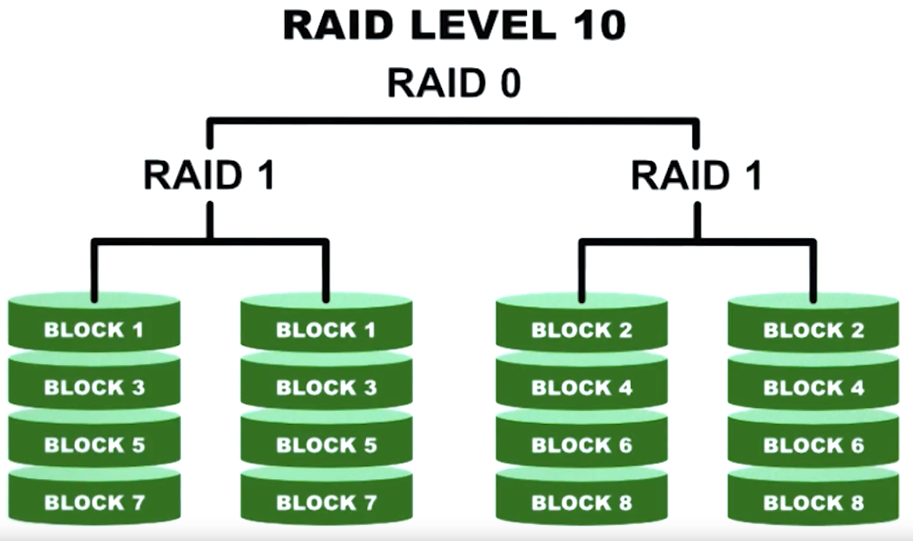
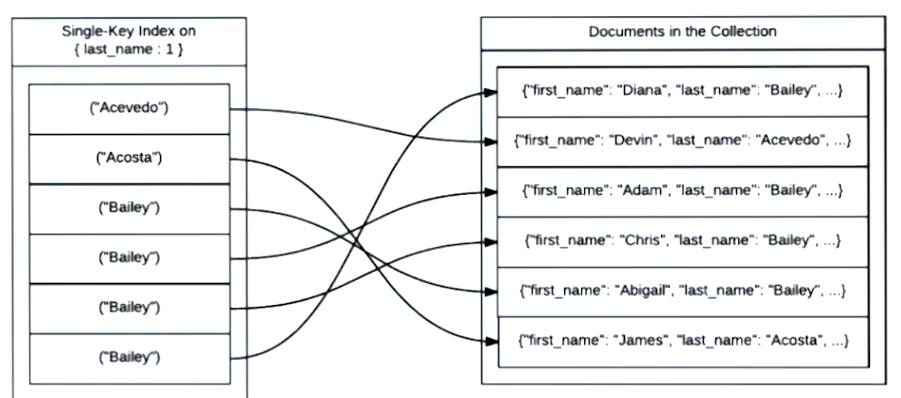
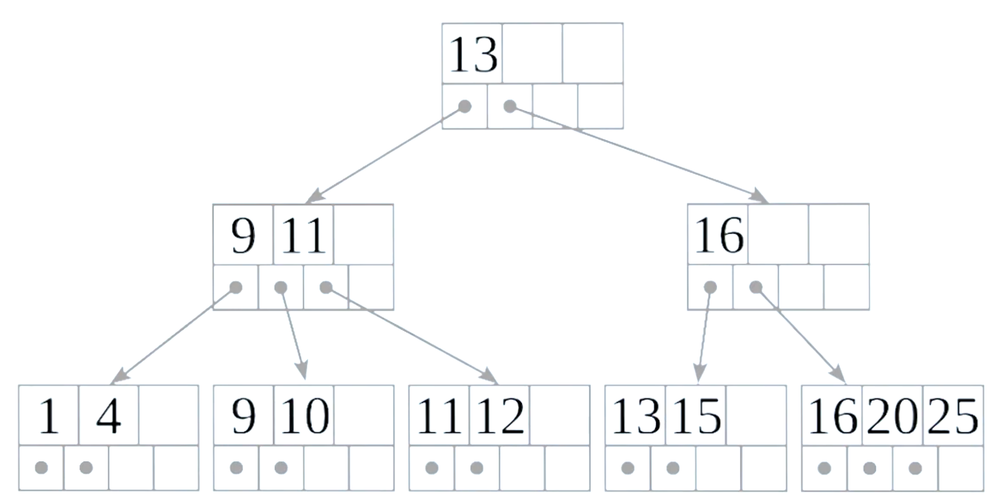

<!-- START doctoc generated TOC please keep comment here to allow auto update -->
<!-- DON'T EDIT THIS SECTION, INSTEAD RE-RUN doctoc TO UPDATE -->
**Table of Contents**  *generated with [DocToc](https://github.com/thlorenz/doctoc)*

- [MongoDB Performance](#mongodb-performance)
  - [Chapter 1: Introduction](#chapter-1-introduction)
    - [Lecture: Hardware Considerations and Configurations Part 1](#lecture-hardware-considerations-and-configurations-part-1)
    - [Lecture: Hardware Considerations and Configurations Part 2](#lecture-hardware-considerations-and-configurations-part-2)
    - [Lab 1.1: Install Course Dependencies](#lab-11-install-course-dependencies)
  - [Chapter 2: MongoDB Indexes](#chapter-2-mongodb-indexes)
    - [Lecture: Introduction to Indexes](#lecture-introduction-to-indexes)
    - [Lecture: How Data is Stored on Disk](#lecture-how-data-is-stored-on-disk)

<!-- END doctoc generated TOC please keep comment here to allow auto update -->

# MongoDB Performance

> My course notes from M201: MongoDB Performance at [MongoDB University](https://university.mongodb.com/)

## Chapter 1: Introduction

### Lecture: Hardware Considerations and Configurations Part 1

Out of scope: Full discussion of how to tune and size hardware for given deployment. But will cover the basics.


Main resources MongoDB relies on to operate:
- CPU for processing and calculations
- Memory for execution -> IMPORTANT!
- Disk and IO for persistency and communications between servers or within host processes

**Memory**

RAM having come down in price makes prevalence of dbs that are designed around usage of memory. It's also 25x faster than SSD's.

Operations depending heavily on memory include:
- Aggregation
- Index Traversing
- Write Operations
- Query Engine (to retrieve query results)
- Connections (~1MB per established connection)

Generally, the more memory MongoDB has available to it, the better its performance will be.

**CPU**

Used by all applications, database is just one of them. Two main factors of MongoDB associated with CPU:
- Storage Engine
- Concurrency Model

By default, MongoDB will try to use all available cores to respond to incoming requests.

Non locking Storage Engine - WiredTiger - relies heavily on CPU to process requests.

If have non-blocking operations (eg: concurrent writes of documents, or responding to query requests - reads), MongoDB performs better the more CPU resources are available.

Operations requiring availability of CPU cycles:
- Page Compression
- Data Calculation
- Aggrgation Framework Operations
- Map Reduce

### Lecture: Hardware Considerations and Configurations Part 2

Not all reads and writes are non blocking operations, such as writing constantly to same document (in-place update) requires each write to block all other writes on that document. eg: given a document

```javascript
{
  _id: "FC Porto",
  message: "Best Club in the World!",
  championships: 756
}
```

And the following series of numerous updates:

```javascript
db.clubs.update({_id: 'FC Porto'}, {$inc: {championship : 1}})
db.clubs.update({_id: 'FC Porto'}, {$inc: {championship : 1}})
...
db.clubs.update({_id: 'FC Porto'}, {$inc: {championship : 1}})
```

In above case, multiple cpu's won't help performance because this work cannot be done in parallel, because they all affect the same document.

**IOPS**

MongoDB uses disk to persist data. IOPS: Input/Output operations per second provided by server. The faster this is, the faster mongo can read/write data. Type of disk will greatly affect MongoDB performance.


Disks can be used in different architectures such as RAID for redundancy of read and write operations.



MongoDB benefits from some but not all architectures.

Recommended raid architecture for MongoDB is RAID LEVEL 10. Offers more redundancy and safeguard guarantees with good performance combination.

DO NOT USE RAID 5, RAID 6. Also avoid RAID 0 - has good write performance but limited availability, can lead to reduced performance on read operations.

RAID 10 provides benefits needed by MongoDB:
- Redundancy of segments across physical drives
- Allows extended performance due to parallelization of multiple writes, reads and reads and writes in same disk allocated segments.

Important aspect of MongoDB is the need to write to several different disks. This distributes IO load of different databases, indexes, journaling and lock files -> optimizes performance.

**Network**

MongoDB is a distributed database for high availability, therefore deployment also depends on network hardware. Faster and larger is bandwidth for network -> better performance.


- Applications reach database by establishing connections to host where MongoDB instance is running.
- High availability achieved with replica cluster sets.
- Horizontal scaling achieved with sharding cluster.

The way that different hosts that are holding different nodes of cluster are connected will affect performance. Other considerations include:
- Types of network switches
- Load balancer
- Firewalls
- How far apart cluster nodes are (across different data centers or regions)
- Types of connections between data centers (i.e. latency - can't go faster than speed of light)

Application, while emitting commands can set:
- Write Concern
- Read Concern
- Read Preference

These need to be taken into consideration when analyzing performance of application.

### Lab 1.1: Install Course Dependencies

Attempt course with Docker:

```shell
docker pull mongo:4.0.0
docker run \
  -p 27018:27017 \
  --name course-mongo \
  -v $(pwd)/input:/data/configdb \
  -v course-mongo-data:/data/db \
  -d mongo:4.0.0
docker exec -it course-mongo bash
mongoimport --db m201 --collection people --file /data/configdb/people.json
mongo
show dbs
use m201
db.people.count({ "email" : {"$exists": 1} })
# submit answer
```

Also install [Compass](https://www.mongodb.com/download-center#compass)

## Chapter 2: MongoDB Indexes

### Lecture: Introduction to Indexes

Indexes trying to solve problem of slow queries.

Example from physical world - book on interior design, trying to find section on bedspreads, could look page by page but that's slow. Faster go to back of book where index is - sorted alphabetically by keywrods with page number. Can quickly find which page the bedspreads section is on.

Translating abvoe example to MongoDB, "Book" -> "Collection".

*Collection Scan:* If not using an index when querying collection, db will have to examine every document. As collection grows in size, will have to search through more documents. This is `O(N)` - linear running time - run time of query is linearly proportional to number of documents `N` in collection.

Index will improve performance:



Index limits search space - don't need to search every document, instead, search through ordered index.

Index keeps reference to every document in collection. Index is list of key-value pairs:
- key: value of field that has been indexed on
- value: value of key is reference to document containing the key

Index is associated with one or more fields (last_name in above example).

When creating an index, must specify which fields from documents want to index on.

`_id` field is automatically indexed.

If a query isn't searching by `_id`, then the `_id` index won't be used.

Can have many indexes on same collection.

Index keys are stored in order. This means db doesn't need to look at every index entry to find the one being queried on.

Index stored in B-tree, used to find target values with few comparisons:



When new documents are inserted, each new insertion doesn't necessarily imply another comparison.

In above example, if searching for value `15`, search wouldn't change if `5` gets inserted.


**Index Overhead**

Performance gain of using index has a cost - each additional index decreases write speed on collection. Every time new document insrted in collection, all the collection's indexes need to be updated.

Also if document is updated or removed, some of the indexes (aka b-trees) may need to be rebalanced.

Be careful when creating indexes - don't create unnecessarily because will affect insert/update/delete performance on that collection.

### Lecture: How Data is Stored on Disk

Databases persist data using the server's file system.


The way mongo stores data on disk differs depending on storage engine supported by MongoDB. Particular details of how each storage engine works are out of scope of this course. But high level review of how each organizes data.

MongoDB supports creating several different data management objects:

```javascript
db.collection.insert({_id: 1})
```


**Database**


- Databases are logical groups of collections.
- Collections are operational units that group documents together.
- Indexes on collections over fields present in documents.
- Documents - atomic units of information used by applications.

**dbpath dir**

Looking at contents of `dbpath` directory, for example, can specify path at mongod startup (this one is default):

```shell
mongod --dbpath /ata/db --fork --logpath /data/db/mongodb.log # start
mongo admin --eval 'db.shutdownServer()'                      # stop
```

Or using Docker:

```shell
docker start course-mongo
docker exec -it course-mongo bash
cd /data/db
ls -l
```

Files:

```
WiredTiger                           diagnostic.data
WiredTiger.lock                      index-1-5808622382818253038.wt
WiredTiger.turtle                    index-3-5808622382818253038.wt
WiredTiger.wt                        index-5-5808622382818253038.wt
WiredTigerLAS.wt                     index-6-5808622382818253038.wt
_mdb_catalog.wt                      index-8-5808622382818253038.wt
collection-0-5808622382818253038.wt  journal
collection-2-5808622382818253038.wt  mongod.lock
collection-4-5808622382818253038.wt  sizeStorer.wt
collection-7-5808622382818253038.wt  storage.bson
```

For each collection and index, WiredTiger storage engine writes an individual `.wt` file.

Catalog file contains catalog of all collections and indexes that mongod contains.


Above is simple flat file organization. Can also have more elaborate structure. Startup mongo with `directoryperdb` instruction:

```shell
docker run \
  -p 27019:27017 \
  --name experiment-mongo \
  -d mongo:4.0.0 --directoryperdb
docker exec -it experiment-mongo bash
mongo hello --eval 'db.a.insert({a:1}, {writeConcern: {w: 1, j:true}})' # write a doc to new db `hello`, collection `a`
ls /data/db
```

This time directory listing is organized differently:

```
WiredTiger       WiredTiger.turtle  WiredTigerLAS.wt  admin   diagnostic.data  journal  mongod.lock    storage.bson
WiredTiger.lock  WiredTiger.wt      _mdb_catalog.wt   config  hello            local    sizeStorer.wt
```

Note 3 new folders due to having specified `directoryperdb` at startup, creates one folder per database:
- admin: default database created by MongoDB
- local: default database created by MongoDB
- hello: newly created database from our insert instruction

Looking inside folder of newly created db:

```shell
ls /data/db/hello
collection-7-1343607420274581578.wt  index-8-1343607420274581578.wt
```

Contains one collection file and one index file (always get _id index).

With WiredTiger storage engine, can go a little further with disk organization. Remove previous container and start again but with `wiredTigerDirectoryForIndexes` instruction:

```shell
docker stop experiment-mongo
docker rm -f experiment-mongo
docker run \
  -p 27019:27017 \
  --name experiment-mongo \
  -d mongo:4.0.0 --directoryperdb --wiredTigerDirectoryForIndexes
docker exec -it experiment-mongo bash
mongo hello --eval 'db.a.insert({a:1}, {writeConcern: {w: 1, j:true}})'
ls /data/db # still get one directory per db
ls /data/db/hello # collection index
```

This time have a directory `collection` and directory `index`:

```shell
ls /data/db/hello/collection/
7--6924425517033069288.wt
ls /data/db/hello/index/
8--6924425517033069288.wt
```

**What does this have to do with performance?**


If have several different disks on server, organizing data as above allows great degree of IO parallelization.

Mongo creates symbolic links to mount points on differnet physical drives.

Every read and write to mongo will use two data structures - collections and indexes. Parallelization of IO improves overall throughput of persistency layer.

**Compression**

Mongo also offers compression for storing data on disk - instruct storage engine to store data on disk using compression algorithm.


Compression improves performance by making each IO operation smaller, which will be faster, but cost more CPU cycles.

Before writing data to disk, data is allocated in memory:


All data in memory is eventually written to disk. This process triggerred by:
- User/application specifies a particular write concern or forcing a sync operation, eg: `db.collection.insert({...}, {writeConcern: {w:3}})`
- Checkpoint: periodic internal process that regulates how data should be flushed/synced into the data file (defined by sync periods).

**Journaling**

Essential component of persistence. Journal file acts as safeguard against data corruption caused by incopmlete file writes. eg: if system sufferes unexpected shutdown, data stored in journal is used to recover to a consistent and correct state.

```shell
ls /data/db/journal
WiredTigerLog.0000000001      WiredTigerPreplog.0000000002
WiredTigerPreplog.0000000001
```

Journal file structure includes individual write operations. To minimize performance impact of journalling, flushes performed with group commits in compressed format. Writes to journal are atomic to ensure consistency of journal files.

App con force data to be synced to journal before acknowledging a write:

```javascript
db.collection.insert({...}, {writeConcern: {w: 1, j: true}})
```

Setting `j: true` will impact performance because mongo will wait until sync is done to disk before confirming the write has been acknowledged.